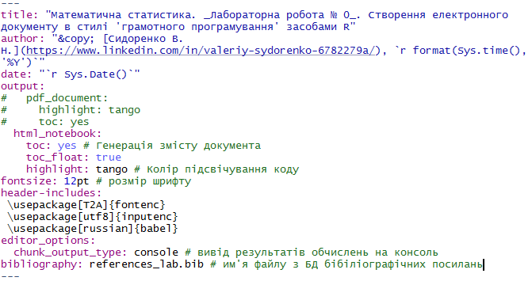

__Мета:__ _quick start для роботи у середовищі RStudio із застосуванням концепції "грамотного програмування" засобами мови програмування R, пакету R Markdown та системи комп'ютерної верстки LaTeX_. 


### Постановка задачі

Побудувати графік функції $y(x)=b_ox+b_1+b_2x^2$ для діапазону $x \in [x_1;x_2]$.

 
### Виконання завдання


1. Створюємо документ R Markdown, як описано вище у п. _Створення RMarkdown-документу_

2. Налаштовуємо потрібним чином YAML-заголовок документу, у якому задаються метадані всього документу (рис. 2). 




2. Для набору формул використовуємо `LaTeX` згідно з правилами [його синтаксису](https://en.wikibooks.org/wiki/LaTeX/Mathematics). Формула у RMarkdown-документі має бути взята у символи $:

`$y(x)=b_ox+b_1+b_2x^2$`


3. Пишемо код на R засобами базової графіки у відповідній зоні, яка називається чанком:

```{r}
library(ggplot2)
library(dplyr)
# Задаємо параметри функції
b0 <- 2
b1 <- 3
b2 <- 1.57

# Задаємо область визначення

x <- seq(-1, 1, .1)
y <- b0 + b1 * x + b2 * x^2

df <- data.frame(x = seq(-1, 1, 0.1)) %>%
  mutate(y = b0 + b1 * x + b2 * x^2)

# Створюємо графік за допомогою ggplot2
ggplot(df, aes(x = x, y = y)) +
  geom_line(color = "red") +     # Лінія графіка
  geom_point(color = "blue") +   # Точки на графіку
  ggtitle("Графік функції") +    # Заголовок
  xlab("x") +                   # Підпис осі x
  ylab("y")                     # Підпис осі y

```
4. Продемонструємо можливості пакету `rio` [@rio] для експорту(імпорту) даних на диск(з диску).

```{r}
# install.packages("rio") # інсталяція пакету
library(rio) # підключення пакету
export(df, "lab 2/data/data.csv")

# packages <- c("rio", "dplyr", "tidyr", "ggplot2")
# 
# install.packages(packages)
# 
# lapply(packages, library, character.only=TRUE)

DT::datatable(df)

```
5. Виконуємо імпорт даних із файлу і візуалізацію у вигляді таблиці. 

```{r results='asis'}
dfNew <-  import("lab 2/data/data.csv")

# Таблиця засобами knitr
knitr::kable(head(dfNew),
             caption = "_Табл. 1. Фрагмент таблиці даних_")

?head()

# Таблиця засобами stargazer
# stargazer::stargazer(head(dfNew),
#                      type = "html",
#                      summary = FALSE,
#              title = "_Табл. 1. Фрагмент таблиці даних_")


# Таблиця засобами xtable
# print(xtable::xtable(head(dfNew),
#                      type = "html",
#                      html.table.attributes="border=0",
#                      summary = FALSE,
#              caption = "_Табл. 1. Фрагмент таблиці даних_"))

```

6. Формуємо результуючу таблицю.

_Табл. 2. Параметри функції_

Параметр | Значення
-----|-----
$b_0$| `r b0`
$b_1$| `r b1`
$b_2$| `r b2`
$x_1$| `r min(x)`
$x_2$| `r max(x)`

__1. Напишіть код на LaTeX для формули щільності нормального розподілу.__

Формула щільності нормального розподілу:

\[ f(x) = \frac{1}{\sigma \sqrt{2\pi}} e^{-\frac{1}{2}\left(\frac{x - \mu}{\sigma}\right)^2} \]

__2. Як вбудувати таблиці та графіки у електронний документ з використанням R Markdown і пакету rmarkdown з оглядом на читабельність та грамотність коду?__

Для виведення таблиць, можна використовувати базові функції R або пакети, такі як knitr або kableExtra.

```{r}
# Виведення таблиці з використанням функції knitr::kable
df <- data.frame(
  Name = c("Андрюша", "Вася", "Петя"),
  Money = c(2500, 3000, 4135),
  Borg = c(10000, 500, 1005)
)

# Виведення таблиці
knitr::kable(df, caption = "Таблиця 1: боржники")
```
```{r}
# Завантажуємо бібліотеку ggplot2
library(ggplot2)

# Створюємо графік
ggplot(df, aes(x = Money, y = Borg)) +
  geom_point() +
  ggtitle("Графік залежності грошей від боргу")
```
Графіки в R Markdown можуть бути створені за допомогою стандартних функцій візуалізації, таких як ggplot2 або базові графічні функції R. Для включення графіків використовується код у R, і він буде автоматично виведений у документ.

Використання Markdown для пояснень перед або після коду. Це допоможе читачам зрозуміти контекст результатів.

__3. Як вирішити завдання зі вставленням та форматуванням зображень в електронному документі з використанням R, забезпечуючи читабельність та елегантність коду?__

У R Markdown зображення можна вставляти безпосередньо через синтаксис Markdown:


Якщо ви хочете вставити вже існуюче зображення (наприклад, збережене в форматі PNG, JPEG або PDF), можна використати функцію knitr::include_graphics.
```{r}

```
__4. Яку роль виконує YAML-заголовок у динамічному документі?__

YAML-заголовок дозволяє задавати основну інформацію про документ, таку як:

Назва документа (title): Визначає заголовок документа.

Автор (author): Вказує ім'я автора.

Дата (date): Вказує дату створення документа.

Тип документа (output): Визначає формат вихідного файлу, наприклад, PDF, HTML, Word тощо.

__Приклад можна переглянути на шапції цієї ЛБ__
