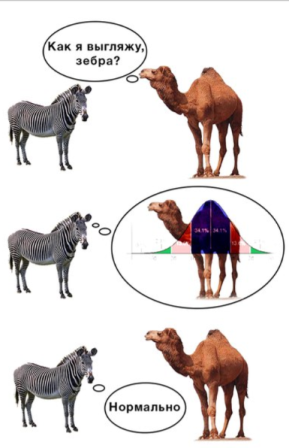

__Мета:__ _засвоїти ідею методики перевірки статистичних гіпотез щодо закону розподілу випадкової величини засобами мови програмування R; набути навичок роботи у середовищі RStudio із застосуванням концепції "грамотного програмування" із застосуванням пакету R Markdown_. 

_Зауваження_. Див. [Основні функції R](http://aakinshin.net/ru/blog/r/functions/#section-strings) [@Akinshin], [Основи синтаксису LaTeX](https://ru.wikibooks.org/wiki/LaTeX) [@LatExSyntaxis].


```{r setup, include=FALSE}
knitr::opts_chunk$set(echo = TRUE)
```


```{r, include=FALSE}
NeedPackages <- c("lattice", "nortest", "goftest", "dgof","latex2exp")
# install.packages("NeedPackages")
lapply(NeedPackages, library, character.only = TRUE)

# nortest #Проверка на нормальность
# goftest #Подгонка непрерывных распределений
# dgof    #Подгонка дискретных распределений 
# DAAG    #Анализ данных и графики
# latex2exp #Вывод формул на график в формате TeX
```


## Що ви будете вміти?

* застосовувати загальноприйняту методику перевірки вибіркових даних на нормальність засобами мови R: від найпростіших "на глазок" до строгих з викорстанням низки параметричних і непараметричних статистичних критеріїв.
* застосовувати методику перевірки статистичної гіпотези щодо будь-якого закону розподілу.
* застосовувати розширені можливості базової графіки `R` на низькому і високому рівні.
* писати прості функції мовою `R` зокрема для розширення можливостей виводу результатів.


## Короткі теоретичні положення{#teor}

Гіпотеза  $H_0:f(x)=f(x, \theta_0)$, де $f(.)$  -- функція щільності, а $\theta_0$  -- відомий скалярний або векторний параметр теоретичного розподілу, з яким перевіряється згода, називається _простою_.    
Гіпотеза  $H_0: f(x) \in \{ f(x, \theta), \theta \in \Theta \}$, де $\Theta$  -- простір параметрів і оцінка скалярного або векторного параметра  $\tilde {\theta}$ обчислюється за тією ж самою вибіркою, за якою перевіряється гіпотеза щодо згоди, називається _складною_. Надалі будемо позначати складну гіпотезу наступним чином  $H_0:f(x)=f(x, \tilde{\theta)}$. Якщо $\tilde{\theta}$  визначається за іншою вибіркою, то гіпотеза _проста_.  
Нижче будемо розглядати складні гіпотези.  

На практиці час від часу можуть виникати задачі, пов'язані з необхідністю встановлювати закон розподілу досліджуваної величини $X$, який може мати як дискретний, так і неперервний характер. Однак найчастіше інженер чи науковець стикається з необхідністю перевірки закону розподілу на нормальність: коректне застосування великої кількості самих різних статистичних методів висуває вимогу нормального розподілення досліджуваних випадкових величин.  

<!-- http://r-analytics.blogspot.de/2012/06/blog-post_14.html#.WurAWaSFMdW -->



Говорять, що неперервна випадкова величина має нормальний (гаусів) закон розподілу з параметрами $a, \sigma^2$ і пишуть $X \sim N(a, \sigma^2)$, якщо (рис. 2)    
$$f(x)=\frac{1}{\sigma \sqrt{2 \pi} }e^{-\frac{(x-\mu)^2}{2 \sigma^2}},$$ $$F(x)=\Phi (\frac{x-\mu}{\sigma}) + \frac{1}{2},$$ $$m(x)=a,$$ $$D(x)=\sigma^2,$$ $$As=0,$$ $$E_k=0.$$
Наприклад, на рис. 2 зображені $f(x), F(x)$ для $X \sim N(0, 1)$.

```{r}
op <- par(mfrow = c(1, 2))
x <- seq(-4, 4, 0.01)
plot(x, dnorm(x, 0, 1),
     frame = FALSE,
     main = "Щільність розподілу",
     xlab = "x",
     ylab = "f(x)",
     type = 'l',
     col = 'red')
grid()
abline(v = 0, col = "lightblue")
# Вивод формули на графік
# text(0.01, 0.01, labels = expression(mu == 0,  sigma == 1), col = "lightblue", adj = c(-.1, -.1))
# Альтернативний варіант вивода формули на графік
text(0.01, 0.01, labels = TeX('$\\mu = 0, \\sigma = 1$'), col = "lightblue", adj = c(-.1, -.1))
plot(x, pnorm(x, 0, 1),
     main = "Функція розподілу",
     frame = FALSE,
     xlab = "x",
     ylab = "F(x)",
     type = 'l',
     col = 'blue')
grid()
abline(v = 0, col = "gray60")
abline(h = 1, col = "lightblue")
par(op)
```


Разом з тим, що процедура перевірки статистичної гіпотези щодо нормальності в цілому схожа з процедурою перевірки статгіпотези щодо будь-якого розподілу, має місце низка певних відмінностей (рис. 3).


Розглянемо детально етапи перевірки на нормальність.  

__1. Оцінка параметрів розподілу: математичного сподівання, дисперсії, асиметрії, ексцесу.__

В якості точкових незміщених і конзистентних оцінок математичного сподівання і дисперсії, які є одночасно оцінками параметрів відповідно $\mu$ та $\sigma^2$, викорстовуються середнє арифметичне та виправлена вибіркова дисперсія:
$$ \mu \approx \overline{x} = \frac{1}{n} \sum_{i=1}^n x_i,$$
$$\sigma^2 \approx s^2 = \frac{1}{n-1} \sum_{i=1}^n (x_i-\overline{x})^2.$$

_Вибіркова асиметрія (skewness)_: $$\tilde A_s= \frac{n \sum(x-\overline{x})^3}{(n-1)(n-2)s^3},$$  

Якщо $\tilde A_s \approx 0$  -- розподіл симетричний.

_Стандартизована вибіркова асиметрія (standartized skewness):_ $$z_1=\frac{\tilde A_s}{\sqrt{6/n}}.$$
Якщо значення $z_1$ виходять за межі інтервалу $[-2,2]$, то є підстави вважати, що розподіл суттєво відрізняється від нормального.

_Вибірковий ексцес(kurtosis)_: $$\tilde E_k = \frac{n(n+1) \sum(x-\overline{x})^4}{(n-1)(n-2) (n-3)s^4}- \frac{3(n-1)^2}{(n-2)(n-3)},$$  

Якщо $\tilde E_k \approx 0$  -- розподіл має куполоподібну форму.

_Стандартизований вибірковий ексцес (standartized kurtosis):_ $$z_2=\frac{\tilde E_k}{\sqrt{24/n}}.$$
Якщо значення $z_2$ виходять за межі інтервалу $[-2,2]$, то є підстави вважати, що розподіл суттєво відрізняється від нормального.


__2. Оцінка ступеня узгодженості гістограми емпіричної функції розподілу з їх параметричними оцінками__

На цьому етапі можна зробити "органолєптичну" оцінку розподілу на нормальність:  
-- якщо після підстановки точкових оцінок у  $f(x)$ та $F(x)$ гістограма (непараметрична оцінка) узгоджується з $f(x)$, а емпірична функція (непараметрична оцінка функції) -- з теоретичною, то є підстави для висунення статгіпотези щодо нормального закону, або вважати, що закон розподілу у першому наближенні є нормальним;  
-- якщо оцінки асиметрії та ексцесу наближені до нуля, а їх стандартизовані оцінки знаходяться у межах $[-2,2]$, то є підстави для висунення статгіпотези щодо нормального закону, або вважати, що закон розподілу у першому наближенні є нормальним.


__3. Оцінка узгодженості даних за графіком квантілєй__

Широко поширеним інструментом для оцінки узгодженості емпіричного закону розподілу з теоретичним є [квантільний графік](https://uk.wikipedia.org/wiki/%D0%93%D1%80%D0%B0%D1%84%D1%96%D0%BA_Q-Q) `Q-Q Plot`. Ідея його є простою:по одній осі відкладаються емпірични значення квантілєй, по іншій -- теоретичні, обчислені за моделлю, що досліджується. При ідеальному співпадінні їх значень точки мають бути візуалізуватися на бісектрисі першого координатного кута.  


__4. Застосування параметричних і не параметричних критеріїв__

Нарешті, безепосередньо для перевірки статистичних гіпотез щодо закону розподілу з наперед заданим рівнем значимості $\gamma=1-\alpha$ існує ціла низка статистичних критеріїв (див. [методичку](doc/practis_3-2018.doc) і  нижче приклад).


## Короткі практичні зауваження

### Створення RMarkdown-документу

1. Завантажуємо [RStudio](https://www.rstudio.com/products/rstudio/download/).

2. Створюємо RMarkdown-документ у форматі [R Notebook](http://rmarkdown.rstudio.com/r_notebooks.html), вибравши відповідний пункт [меню](https://prnt.sc/gkpes4).


### Генерація електронного документу

Генерація електронного документу здійснюється натисканням комбінації _Ctrl+Shift+K_.

## Приклад виконання лабораторної роботи

### 1. Постановка задачі{#task}

Випадкова величина  $X$  має заданий закон розподілу, вектор параметрів якого відомий. Згенерувати згідно з варіантом вибірку випадкової величини $X=(x_1,...,x_n)$: спочатку об’єму  $n=50$, що має заданий розподіл, обчислити оцінку вектора параметрів розподілу. 
Висунити і перевірити статистичну гіпотезу щодо нормального закону розподілу величини $X$:  
$H_0: f(x) \in \{ N(x, \mu, \sigma^2), \mu \in \mu, \; \sigma^2 \in  \Sigma^2 \}$  
$H_1: f(x) \notin \{ N(x, \mu, \sigma^2), \mu \in \mu, \; \sigma^2 \in  \Sigma^2 \}$  

Повторити дослідження для  $n=1000$. Порівняти результати, зробити висновки.

_Зауваження_. Згенеровані вибірка мають бути експортовані на диск у каталог `data`. Для послідуючого аналізу дані мають бути імпортовані з диску у середовище і сформовано `data.frame` з наступними полями:


$x_{50}$ | $x_{1000}$ | $n$
---|---|---
?|?|?  


### 2. Виконання роботи (основні моменти)

__Генеруємо вибірку за допомогою генератора випадкових чисел і записуємо дані у файл.__

```{r}
# Генерируем выборку в соответствии с заданным распределением
# (В данном случае - нормальный с параметрами "а" и "s")

# Генерируем нормальую выборку
# ВАЖНО!!!- используется аналог функции RANDOMIZE - set.seed()

set.seed(0)
a <- 0
s <- 1
n <- 100
X <- rnorm(n, a, s) #генерируем выборку
head(X)

# Запись выборки в файл
write.table(file = "data/X3.csv", X,
            row.names = FALSE,
            dec = ".",
            col.names = FALSE,
            sep = ";",
            quote = FALSE)
rm(X)
X <- read.table("data/X3.csv")
X <- as.numeric(X$V1)

# Просмотр первых и последних строк таблицы
head(X)
tail(X)

# График выборочных точек
plot(X, main = "Scatterplot", col = 4) # -> График точек

```
__Обчислюємо вибірковічислові  характеристики.__

__Зауваження__.  
__Самостійно__ написати функцію для оцінки асиметрії та ексцессу та стандартизованих значень асиметрії та ексцесу (рівень 1).  
__Самостійно__ написати функцію, що виводить у таблицю математичне сподівання, дисперсію, СКВ, оцінки асиметрії, ексцессу та стандартизованих значень асиметрії та ексцесу (рівень 2).  
__Підказка__. Для форматованого виводу доцільно використовувати функцію `cat()`. Дуже корисні ресурси для швидкого розуміння основних конструкцій мови `R` та принципів написання коду див [тут](https://aakinshin.net/ru/posts/r-functions/) і [тут](http://zoonek2.free.fr/UNIX/48_R/02.html).


```{r}
# # Приклад функції для форматованого виводу.
# SampleCharacteristics <- function(x) {
#   cat("Sum:", sum(x), "\n", "mean:", mean(x), "\n")
# }

# Функції користувача доцільно розміщувати у окремому файлі і імпортувати їх у скрипт
source("mymethods.R")

x <- rnorm(100, 0, 1)

SampleCharacteristics(x)

```


```{r}
summary(X)
mean(X)
sd(X)
```

```{r}
# Выводим рядом четыре основных графика
op <- par(mfrow = c(2,2)) #Сохраняем старые параметры вывода
dotchart(X, main = "Cleveland's Dot Plots", col = 4) #Точечная диаграмма Кливленда

# Ящик с усами
boxplot(X, width = 2,
        range = 1, 
        col = "gray",
        border = 4, 
        main = "Box-and-Wiskers Plot")

# Гистограмма относительных частот 
hist(X, freq = FALSE,
     breaks = nclass.Sturges(X),
     col = "grey")
curve(dnorm(x, a, s),
      col = 2, 
      lty = 2, 
      lwd = 2, 
      add = TRUE) #сверху кривая плотности
curve(dunif(x, -2, 2),
      col = 3, 
      lty = 2, 
      lwd = 2, 
      add = TRUE) #сверху кривая плотности равномерного распределения
curve(dt(x, df=10),
      col = 4,
      lty = 2,
      lwd = 2,
      add = TRUE) #сверху кривая плотности распределения СТьюдент

# Эмпирическая функция распределения F(x)
Fn <- ecdf(X)
plot(Fn,
     ylab = "",
     verticals = TRUE, 
     col.points = "blue",
     col.hor = "red",
     col.vert = "bisque",
     main = "Probability Distribution Function")
curve(pnorm(x, a, s),
      col = 6,
      lty = 1,
      lwd = 2,
      add = TRUE) # -> сверху кривая плотности

curve(pnorm(x, mean(X), sd(X)),
      col = 2,
      lty = 1,
      lwd = 2,
      add = TRUE) # -> сверху кривая плотности

# Добавляем легенду
legend("bottomright",
       pch = c(19, NA, NA),
       legend = c("Fn(x)", "F(x)","Fvol(x)"),
       lty = c(1,1,1), col = c(4,6,2), lwd = c(NA,2,2))
par(op) #Возвращаем параметры по умолчанию 
```

```{r}
# ПОСТРОЕНИЕ ГИСТОГРАММЫ: количество карманов - 20,
# по умолчанию - "Sturges", заголовок отсутсвует

table(cut(X, nclass.Sturges(X))) #Вывод интревального вариационного ряда

# Гистограмма частот 

hist(X,
     breaks = nclass.Sturges(X),
     col = "lightblue",
     main = "") #Число карманов по Стерджессу
plot(density(X))

# Гистограмма частот совместно с кривой эмпирической плотности
# (альтернативны вариаант, описанному выше) 
hist(X, 
     breaks = nclass.Sturges(X),
     freq = FALSE,
     col = "lightblue",
     xlab = "X",
     ylab = "Плотность вероятности",
     main = "Гистограмма, совмещенная с кривой плотности")
lines(density(X),
      col = "red",
      lwd = 2)
# dev.off()
```


```{r}
# Расчет пяти квантилей 
quantile(X)
```


```{r}
############### ПРОВЕРКА НА НОРМАЛЬНОСТЬ ###############

qqnorm(X, col=4)
qqline(X, col=2)

qqmath(~X) # Аналог qqnorm() из пакета LATTICE
            # (См. справку - очень большие возможности!)

# Квантиль-квантильный график для произвольного раcпределения
# в данном случае для равномерного

qqplot(qunif(ppoints(length(X)), -2, 2), X,
       main = "Q-Q plot for U(-2,2)", col=4)
qqline(X, distribution = function(p) qunif(p, -2, 2),
       prob = c(0.1, 0.6),
       col = 2)
mtext("qqline(*, dist = qunif(., -2, 2), prob = c(0.1, 0.6))")
```


```{r}
#Тест Шапиро-Уилкса 

shapiro.test(X) #ВНИМАНИЕ! Здесь  и дальше
                 # Если p > 0.05 - Нулевая гипотеза не отвергается

#Тест Колмогорова-Смирнова

ks.test(X,"pnorm") #первый вариант
ks.test(X, rnorm(length(X))) #второй вариант
```

```{r}
# Тест Андерсона-Дарлинга
# ad.test(X)

# Тест Крамера фон Мизеса
# cvm.test(X)

# Тест Колмогорова-Смирнова в модификации Лилиефорса
lillie.test(X)

# Критерий Хи-квадрат Пирсона
pearson.test(X)
pearson.test(X, n.classes=nclass.Sturges(X))
# str(pearson.test(X))

# тест Шапиро-Франсия
sf.test(X)
```

__Зауваження__.  
__Самостійно__ написати функцію, що виводить у таблицю значення всіх вищезазначених критеріїв та результат перевірки на нормальність (рівень 2).


## Порядок виконання лабораторної роботи.

1. Ознайомитися з [короткими теоретичними положеннями](#teor).  __Варіанти індивідуальних завдань відповідають завданням лаб. ро. №2__. Детальні теоретичні аспекти знаходяться у методичці для виконання практичних робіт.  
1. Вибрати варіант індивідуального завдання.  
1. Створити проект, в основі якого лежить документ RMarkdown у форматі RNotebook, для розв'язання [задачі](#task) згідно з вибраним варіантом. __За основу взяти RNotebook документ цієї методички__. Проект має містити наступні розділи:
  i) Постановку задачі з детальним описом заданого розподілу і його параметрів.
  i) Розв'язок задачі з необхідними коментарями.
  i) Висновки.
  i) Перелік посилань на основі bib-файлу.
  


## References

